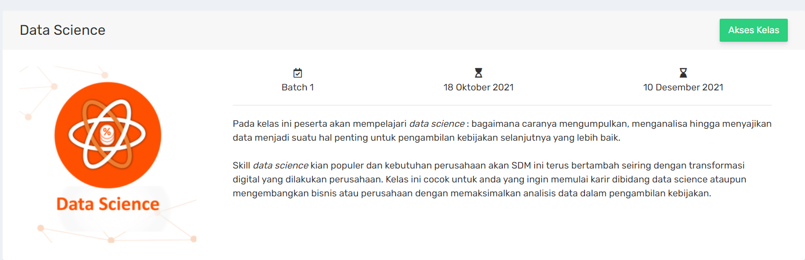
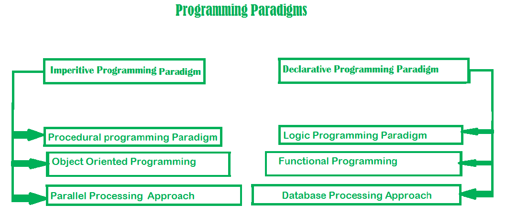
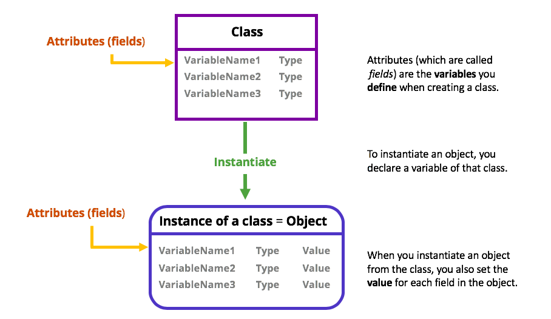

# Bootcamp_Py

Pada kelas ini peserta akan mempelajari data science : bagaimana caranya mengumpulkan, menganalisa hingga menyajikan data menjadi suatu hal penting untuk pengambilan kebijakan selanjutnya yang lebih baik. 

Skill data science kian populer dan kebutuhan perusahaan akan SDM ini terus bertambah seiring dengan transformasi digital yang dilakukan perusahaan. Kelas ini cocok untuk anda yang ingin memulai karir dibidang data science ataupun mengembangkan bisnis atau perusahaan dengan memaksimalkan analisis data dalam pengambilan kebijakan.

OOP

